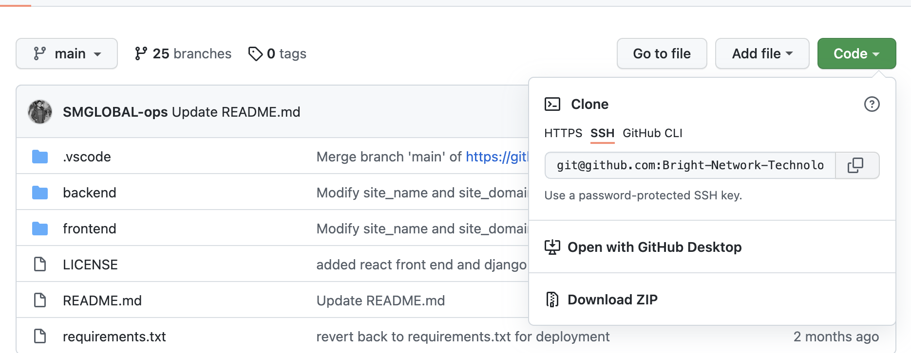
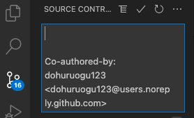

# BNTA Course Notes

# Git, GitHub and Hosting Notes

## I. Git vs. Github

- **Despite the naming convention, git and GitHub are not the same thing!**
  - Git is an open-source, version control tool created by developers working on the Linux operating system.
  - GitHub is a company founded later that makes tools which integrate with git.
- **You do not need GitHub to use git, however you cannot use GitHub without using git.**
- There are many other alternatives to GitHub, such as GitLab and BitBucket. All of these options are referred to as “remotes” in git-terminology, and all are completely optional. Whilst you do not need to use a remote to use git, it will make sharing your code with others easier.

_Source(s)_: _<https://product.hubspot.com/blog/git-and-github-tutorial-for-beginners>_

---

## II. Intro to the Linux Shell, aka the "_Terminal_"

Since the virtual machines being used throughout this bootcamp are configured to use the Linux operating system (OS), it will be useful to have a few of the basic commands under your belt. In short, a shell is a program that receives commands from the user and gives it to the OS to process, and then it shows the output. Linux has a Command Line Interface (CLI) that can be interacted with using the following commands (this is a non-exhaustive list, but will be enough to get you started):

- `pwd`: lets you access your _present working directory_ - this is the absolute path, which means the path that starts from the root. The root is the base of the Linux file system. It is denoted by a forward slash( / ).
- `ls`: lets you know what files are in the directory you are in. You can see all the hidden files by using the command `ls -a`.
- `cd`: lets you _change directory_ e.g. `cd Downloads` will move you to the Downloads directory given you are already in the parent directory. If you just type `cd` and press enter, it takes you to the home directory. To go back from a folder to it's parent folder, you can type “cd ..” . The two dots represent back in this case.
- `mkdir`: lets you create a new folder or directory e.g. `mkdir new_folder_name_here`.
- `rmdir`: lets you delete a directory, but can only be used to delete an empty directory.
- `rm`: lets you delete files and directories. Use `rm -r` to delete just the directory. It deletes both the folder and the files contained when using just the `rm` command.
- `touch`: lets you create a new file e.g. `touch new_filename.txt`.
- `man`: lets you learn more about a command and see the ways in which it can be used e.g. `man cd` will give you information about the `cd` command.
- `cp`: lets you copy files through the command line. It takes two arguments: The first is the location of the file to be copied, the second is where to copy the file to e.g. `cp file.txt /home/folder`.
- `mv`: lets you move files through the command line. You can also use the `mv` command to rename a file e.g. to rename a file currently called file.txt to one called new_file.txt, simply write `mv file.txt new_file.txt`.
- `locate`: lets you locate a file in a Linux system, just like the search command in Windows. This command is useful when you don't know exactly where a file is saved or even the actual name of the file. Using the -i argument with the command helps to ignore the case of the search term. Therefore, if you want a file that has the word “hello”, it gives the list of all the files in your Linux system containing the word "hello" when you type in `locate -i hello`.
- `echo`: lets you move some data, usually text into a file. For example, if you want to create a new text file or add to an existent text file, you just need to run `echo hello world >> new.txt`.
- `cat`: lets you display the contents of a file.
- `nano`: nano is a pre-installed text editor in the Linux command line; it denotes keywords with color and can recognize most languages. If you need to make a new file named "new_file.txt", you can create it by using the command `nano new_file.txt`. You can save your files after editing by using the sequence Ctrl+X, then Y (or N for no, if you want to continue making changes).
- `sudo`: stands for "SuperUser Do". So, if you want any command to be done with administrative or root privileges, you can use the sudo command. For example, if you want to edit a file like base.conf (a configuration file), which needs root permissions, you can use the command – `sudo nano base.conf`.
- `apt-get`: lets you install packages. This requires root privileges, so you need to combine the sudo command with it. For example, if you want to install a new package, you can type in the command `sudo apt-get install new_package_name`.
- `zip`: lets you compress files into a zip archive.
- `unzip`: lets you extract files from a zip archive.

Here are a few tips and tricks for using the Linux CLI:

- You can use the `clear` command to clear the terminal if it gets too filled up.
- The TAB key can be used to auto-complete e.g. you just need to type `cd Doc` and then TAB and the terminal auto-completes to `cd Documents`.
- Ctrl+C can be used to stop any command in the terminal safely. If it doesn't stop with that, then Ctrl+Z can be used to force the stopping.
- You can exit from the terminal by using the `exit` command.
- You can power off or reboot the computer by using the commands `sudo halt` and `sudo reboot`, respectively.
- Something extremely useful to set up is the quick-lauch shortcuts from the terminal for both VSCode and IntelliJ. These shortcuts allow you to navigate to a specific directory in your terminal and then launch the files in that folder using a one line command such as `code .` - for VSCode. That way there is no need to launch VSCode separately and open the files by navigating through the menus.

  - For VSCode, simply open the app, and press <kbd>Command</kbd> + <kbd>Shift</kbd> + <kbd>p</kbd> , then type `shell` into the command palette. Select the option called "Shell Command : Install code in PATH" from the suggested list. That's it, from now on, you can simply navigate to your project directory in the terminal and type `code .` to have it open VSCode inside the project for you!

  

  
  

  - You are able to follow a similar process for setting up the command line launcher for IntelliJ; in that case, the command to launch the IDE is simply `idea .`. However, since you won't be needing that until you reach the Java section of the bootcamp, you can feel free to use this link at that time to guide you through the process: <https://emmanuelbernard.com/blog/2017/02/27/start-intellij-idea-command-line/> .

_Source(s)_: _<https://maker.pro/linux/tutorial/basic-linux-commands-for-beginners>_

---

## III. Intro to Git: Setup and Basic Commands

- Please refer to the slides for the material covered on : trees, branches, areas, stashing, version control, benefits, and collaboration.
- The slides can be found here: <insert_link_here>
- If you'd like some practise with git concepts, feel free to visit the interactive git branching website used during class time: <https://learngitbranching.js.org/>

Now that you have a conceptual idea of how git works, lets start you off on getting to grips with some of the more practical applications of it.

**Creating a local git repository**

If you're creating a new project on your local machine using git, the first thing you'll do is create a new repository (aka "repo"). The first step will be to open a new terminal and move to the directory where you want your project folder to be saved, once there, you'll create your new project and then move inside of it.

  

Once you're inside that folder, you'll want to initialise a git repository in the root of the folder by running the `git init` command.

  

\* **Note**: You can ignore the yellow warning message, it's simply informing you to run `git config --global init.defaultBranch whatever_name_you_want_here` so that in future all of your initial branches share the same desired name. The current naming convention is "master" in git, however there is an ongoing debate regarding GitHub's recent decision to make their naming convention "main" for primary branches. You can read more about it at this link if you wish: <https://github.com/github/renaming>. However, for now, you might consider running the line `git config --global init.defaultBranch main` in order to supress this warning in future. An alternative option, if you just want to rename the initial branch for _this_ project, is to run `git init --initial-branch=main` instead of just `git init`.

Now that you have a new repo initialised, you can go ahead and add a file to it using the `touch new_file_name.txt` command that creates and saves a blank file with whatever name you provide it. Referring back to the terminal commands in the previous section of this document, you'll see that you can type `ls` to a see a list of all files inside your current folder.

  

Once you've added or modified files in a folder containing a git repo, git will notice that the file exists inside the repo. But, git won't track the file unless you explicitly tell it to do so. Git only saves/manages changes to files that it tracks, so you’ll need to send a command to inform git that you want to track your newly created file.

In order to see which files git recognises exist, you can run the `git status` command.

  

As you can see, the response message in the screenshot above is basically informing you that git noticed there has been a new file created, but unless you use the `git add` command, git isn't going to do anything further with it - hence, it will be untracked.

The next step now is - you guessed it - to add the file to the staging environment using the `git add .` command. You usually have to specify `git add name_of_file_here`, but if you add `.` instead, then it will add _all_ of your current untracked files to the staging area. If you now rerun the `git status` command, you'll see that git has added the file to the staging environment (beneath the "Changes to be committed" line).

  

At this point, the file has been added to the staging environment, but has **not yet been committed**. To create your commit, run the line `git commit -m "A message describing the changes made in your commit"` .

  

---

**Side note: How to write a good commit message**

Despite the commit message seeming a trivial part of the process, there is actually a strictly followed etiquette (and reasoning) behind it.

The message should be something related to what the commit contains - maybe it's a new feature, maybe it's a bug fix, maybe it's just fixing a typo. Since this commit will likely be a permanent part of your repository, you must ensure that you leave a clear explanation of your changes as it can be extremely helpful for future programmers (perhaps future you!) who are trying to figure out why some change was made years later. Git is all about creating a legacy of code that is easily accessible!

Listed below are some general rules you should attempt to abide by when writing your own commit messages (_Source(s): <https://www.freecodecamp.org/news/writing-good-commit-messages-a-practical-guide/>_):

1. Specify the type of commit:
   feat: The new feature you're adding to a particular application
   fix: A bug fix
   style: Feature and updates related to styling
   refactor: Refactoring a specific section of the codebase
   test: Everything related to testing
   docs: Everything related to documentation
   chore: Regular code maintenance.[You can also use emojis to represent commit types]
2. Separate the subject from the body with a blank line
3. Your commit message should not contain any whitespace errors
4. Remove unnecessary punctuation marks
5. Do not end the subject line with a period
6. Capitalize the subject line and each paragraph
7. Use the imperative mood in the subject line
8. Use the body to explain what changes you have made and why you made them.
9. Do not assume the reviewer understands what the original problem was, ensure you add it.
10. Do not think your code is self-explanatory
11. Follow the commit convention defined by your team

A good example of the various components that you could possibly include in a commit message are shown in the example below:

      `Capitalized, short (50 chars or less) summary

      More detailed explanatory text, if necessary.  Wrap it to about 72
      characters or so.  In some contexts, the first line is treated as the
      subject of an email and the rest of the text as the body.  The blank
      line separating the summary from the body is critical (unless you omit
      the body entirely); tools like rebase can get confused if you run the
      two together.

      Write your commit message in the imperative: "Fix bug" and not "Fixed bug"
      or "Fixes bug."  This convention matches up with commit messages generated
      by commands like git merge and git revert.

      Further paragraphs come after blank lines.

      - Bullet points are okay, too

      - Typically a hyphen or asterisk is used for the bullet, followed by a
      single space, with blank lines in between, but conventions vary here

      - Use a hanging indent

      If you use an issue tracker, add a reference(s) to them at the bottom,
      like so:

      Resolves: #123`

\* **Note**: The Resolves number at the end of the message above could link to the card from your team's Kanban board (discussed below) that you are dealing with using the code in your commit.

In general though, you don't need to worry about abiding by all the rules mentioned above, just try to keep your message concise, relevant, and useful!

---

Anyway, back to it...

So far we've been working on a single branch, in this case that branch is main. The "main" branch - sometimes called "master" or "primary", is the branch with the latest, most-complete version of the project code, and it is usually the branch containing the deployed version of the code (don't worry about what deployed means just yet, you'll get to that later in the course). But, if you wanted to add a new feature to your project and didn't want to run the risk of breaking the code on the main branch whilst in the development process for that new feature, then you will likely want to create a new git branch. Branches allow you to move back and forth between 'states' of a project. Once you're done with the page, you can merge your changes from your branch into the primary (main) branch. When you create a new branch, Git keeps track of which commit your branch 'branched' off of (it will have created an exact replica of that branch on your new branch to begin with), so it knows the history behind all the files.

In order to create a new branch, you can run the command `git checkout -b name_of_branch_here`. This command will create the new branch and will then move you to that new branch (check you out there) so that you can immediately begin working on it. Once you've created the branch, you can see a list of all the branches currently in your repo by running the command `git branch`. The branch with `*` next to it (and text in green) denotes the branch you are currently working on.

When you want to move to another branch that already exists, simply run `git checkout name_of_branch_here` (without the -b).

Lastly, if you want to see a list, or history, of all the previous commits made to your project, then you can run `git log` . This will give you the details of the contributor, date/ time, and their commit message. We'll get into why this is can be useful later in this document.

As you can see above, at this point there has only been one commit to the branch so far, but this can get into the hundreds or even thousands in some cases!

Wrapping up - in terms of git commands that you would most likely use locally, I think we have covered them all at this point; the next stage is to now integrate what you have learned so far regarding git commands to the services offered by GitHub - that's where things become more useful!

_Source(s):<https://product.hubspot.com/blog/git-and-github-tutorial-for-beginners>_

---

## IV. Intro to GitHub

If you haven't yet set up a GitHub account, you can do so using the following link: <https://github.com/signup>

---

**Adding an SSH key (_IMPORTANT!_)**

Once you have created a GitHub account, the next step will be to add a new SSH key to your GitHub account. The SSH (Secure Shell) protocol is used so that you can connect and authenticate to remote servers and services. With SSH keys, you can connect to GitHub without supplying your username and personal access token at each visit. You can visit this link and follow the instructions to add your SSH key (select the Linux tab once you're there):
<https://docs.github.com/en/authentication/connecting-to-github-with-ssh/adding-a-new-ssh-key-to-your-github-account>

---

Now that's done, you're ready to get going with using GitHub to make sharing your code easier than ever!

Firstly, you'll want to head to GitHub (<https://github.com/>) and log in with your newly created credentials.

---

**Creating a GitHub repo and linking it to your local repo**

To create a new repo on GitHub, navigate to the “New repository” option under the “+” sign next to your profile picture, in the top right corner of the navbar.

You'll then need to fill in the repository name (make this either the same name as your project, or something obvious and useful for your future collaborators to recognise). You'll have the option to make the repository either public or private - these options simply relate to who can view and commit to your repo. For now, just leave it as public since this will mean that you won't have to handle any permissions or access issues for any collaborators. It's useful to add a README file when initialising your repo since this is often used to provide any visitors to your repo a general overview of your project, the tech stack used, and maybe some instructions for accessing and using your code - but for now this will be just an empty template file.

GitHub will then ask if you want to create a new repo from scratch or if you want to add a repo you have created locally. In this case, since you've already created a new repo locally, you want to push that onto GitHub so follow the '....or push an existing repository from the command line' section of the prompt. That involves running the command `git remote add origin insert_web_url_to_repo_here`. The URL to your newly created repo can be accessed by clicking on the green code button on the home page of your repo as shown below (be sure to copy the SSH link to your clipboard!):

Now simply head back to the terminal and paste the SSH link onto the end of the command mentioned in the previous paragraph to connect your local repo to the GitHub one. You'll then want to run `git push -u origin master` in order to push a copy of your local master branch to the GitHub repo so that everyone else has access to your code too! A quick note, if you decided to rename your initial branch to 'main' when initialising the repo, then you'll want to switch out 'master' for 'main' in the command just mentioned.

---

**Pushing branches with local commits to GitHub**

Next you'll push the commit in your new branch locally to your new GitHub repo. This allows other people to see the changes you've made. And, if they're approved by the repository's owner, the changes can then be merged into the primary branch.

To push changes onto a new branch on GitHub, you'll want to run `git push origin branch_name_here`. GitHub will automatically create the branch for you on the remote repository.

Now, if you visit the GitHub repo page, you'll notice that there are now 2 branches: main, and your newly pushed branch.

The next step here is to create a pull request (PR), and GitHub has detected this for you and made the suggestion as shown in the screenshot above. A PR is your opportunity to inform the owners of the repo that you have made some changes and that you would like them to be reviewed before being merged to the primary branch. This is best practice to help avoid any mistakes or potential bugs - that you didn't spot on your own - slipping through the net and affecting the deployed version of the code.

Simply click on the green button that says 'Compare & pull request'. At this point, you will write a title for the change you have made and possibly a short comment detailing the specifics of your change - this will help the reviewers who will be checking out your code before approving it. Depending on your team's setup, you might be able to select who should be requested to review your code in the relevant righthand dropdown; here you should discuss with your team who should be allocated who's code beforehand. You don't want to burden everyone with this process, but equally, you want to ensure that the review process is thorough enough.

Once all the requested dvelopers have reviewed your PR, the pull request can be merged with the primary branch and your code will be included in the latest version.

At this point, the person who has confirmed the merge of the branches will be prompted to delete the initial pull request branch as shown below.

The last step here will be to get the latest changes resulting from the merge back into your local repo. The way to do that is to run `git pull origin main`. Once you have done this, you can begin to branch out again as you create more and more features - following the exact same process each time!

_Source(s): <https://product.hubspot.com/blog/git-and-github-tutorial-for-beginners>_

---

**Cloning a Repo**

Now, you'll be glad to know, that usually if you're working as part of a larger team - especially if you're joining quite late on into the development process - you won't have to go through all the steps listed previosuly for creating a local git repo and linking it to a remote GitHub repo. Instead, the remote repo will already be setup, and it will just be a case of you cloning the repo locally and beginning to work on a new branch again.

You should already be setup with your SSH key at this point, but if not then refer to the paragraph in the Intro to GitHub section on generating SSH keys and adding them to your GitHub acount because you'll need to have done that in order to clone a repo. The second requirement is for you to have 'forked' the repo you want to clone to your GitHub account beforehand, you can do that by simpling visiting the page for the repo and clicking on the 'fork' button in the top right corner as shown below.

The next step is to click on the green 'Code' button for the repo and select the SSH header under the Clone section. Here you will copy the SSH path to your clipboard.

The last step is to head back to your terminal and run `git clone paste_SSH_path_here` in the directory where you want the code to exist (refer back to the Linux commands section if you're struggling on creating a new directory).

And that's it, you'll have all the code on the remote repo locally on your machine! An exact copy of it, or _clone_ if you will!

---

**Rebasing**

As you progress in Git and GitHub, especially in a more professional setting, you'll likely hear the term 'rebase' getting thrown around quite a bit. Git rebasing is a somewhat more advanced tool offered by Git, and hence it won't be covered in depth here since you will likely be new to all of this - but it's certainly worth mentioning.

A `rebase` is essentially a way for you to shift changes made from one branch to another; it is similar to a `merge`, except that it also allows you to rewrite the history of a Git repository - magic, right?! When you run a `rebase` , the entire history (which can be viewed using `git log`) of the two branches in question are merged into one. This means that you are basically changing the base of a branch from one commit to another, hence altering the repo's history to give the impression that you created a branch from another commit.

Rebasing is used to maintain a project history's integrity when you want to integrate changes from _upstream_ (e.g. from a remote main branch that is ahead of your local current working branch). If the code on your local branch isn't finished yet, but you want to see how it will integrate with the latest changes made on the main branch, then rebasing might be the best option for you! This way you can combine the history of changes made on the main branch with all of your own history of changes. Then, when ready, you can create a PR with your finished branch without worrying about losing any work that others have completed in the meantime.

If you want to learn more about rebasing, or find yourself later in the course in a similar scenario to the one described above, then feel free to visit the source below for more information on how to perform it.

_Source(s): <https://careerkarma.com/blog/git-rebase/>_

---

## Live Demo (screenshare)

If you and a colleague would like to replicate what was done during the live demo in class, feel free to follow the steps below:

1. One person creates a repo and shares the SSL link with the other person.
2. Other person uses terminal to clone the repo with the link.
3. That person creates a new branch locally, makes some changes and then goes through the add, commit, push process for that branch.
4. Original person pulls that branch locally and shows how to deal with merge conflicts and then pushes back to the origin.
5. Show a git log and git status and explain what's just happened between the two contributors.

---

## V. Additional Git and GitHub Features

---

**.gitignore files**

- When you begin working on larger projects, you'll start to realise that there are 100's, if not 1000's of files, dependencies, and packages that are created as part of the scaffolding of your project e.g. when working node. However, you don't want your commits and pushes to GitHub getting inflated and overrun with files that don't need to be there (for example, every person working on your project will have node installed locally and can gain access to these files themselves without the need to pull them from Github). For that reason, GitHub has a an option to include a `.gitignore` file within your project; this is a text file that allows you to tell Git which files or folders you'd like to ignore in a project, and hence not have them committed each time. This file is normally placed in your project's root directory. In order to include one in your own project, simply create a file at the top level project folder and call it `.gitignore`, and within that file you can specify files to ignore in the following way:

_Source(s): <https://www.freecodecamp.org/news/gitignore-what-is-it-and-how-to-add-to-repo/>_

---

**VSCode Integration**

- Another invaluable feature of GitHub is its integration with VSCode. VSCode has the LiveShare extension to allow you to collaborate with others on the same copy of the code (something you will become very accustomed to as time goes on). However, to use this effectively it is recommended that you log in to GitHub via VSCode beforehand to make sure that both accounts are synced. This will mean that the commit message from the LiveShare host will contain a section stating that you (referred to by your GitHub username) contributed to the commit in some way. Therefore, it is imperative that you log in to GitHub through VSCode at the outset to make collaboration and accountability go as smoothly as possible throughout the bootcamp. You can see an example of the contribution message below when you have worked in a LiveShare environment hosted by somebody else.

---

**GitHub Projects: Kanban boards**

- Kanban is a task-based project management style typically used in industry - often used as a part of "sprints".
- A typical Kanban board would look something like this:

  

- Tasks are given a ticket number, to keep track of what needs doing and when the problems arose and were solved. These ticket numbers would be referenced in any commits relating to the ticket (mentioned in a previous section).
- Tickets are moved through the board as each task reaches a different stage. This is just a simple example board, but they can get a little more complex depending on the size and scope of the project e.g. backlog, testing, design stage, deployment.
- There are many companies, apps and programmes that have Kanbans as part of their setup for you to make. We're running through how to make them on GitHub, so they can be part of a code repository
- Is very easy to set up. Head to your GitHub repo that you want to create a board for and click 'Projects' at the top:

  

- Follow the screen through, give your board a title and description.
- Github gives you the option to choose from a number of templates, or just start blank and create your own accustomed to what you want. In the example shown is the basic Kanban template, which works well for simple projects:

  

---

## VI. Intro to GitHub Pages (Hosting)

- You can use GitHub Pages to host a website about yourself, your organization, or your project directly from a GitHub repository.
- GitHub Pages is a static site hosting service that takes HTML, CSS, and JavaScript files straight from a repository on GitHub and publishes a website.
- You can host your site on GitHub's github.io domain or your own custom domain.
- There are three types of GitHub Pages sites: project, user, and organization. Project sites are connected to a specific project hosted on GitHub, such as a JavaScript library or a recipe collection. User and organization sites are connected to a specific GitHub account.
- GitHub Pages sites shouldn't be used for sensitive transactions like sending passwords or credit card numbers.
- Since the Github Pages service is free-to-use, there are some limitations to it:
  - Published GitHub Pages sites may be no larger than 1 GB
  - GitHub Pages sites have a soft limit of 10 builds per hour. A new build is likely to coencide with a new PR being merged.
    However, for your purposes at the start of this course, GitHub Pages is completely fine to use. Only later on, during larger projects, might you consider alternative hosting services that will better suit your requirements.

_Source(s): <https://docs.github.com/en/pages/getting-started-with-github-pages/about-github-pages>_

**Creating a Github Pages site**

- Steps for creating a GitHub pages website (which you will do as part of this afternoon's tasks) can be found in a well-documented, easy-to-follow manner at the following link: <https://docs.github.com/en/pages/getting-started-with-github-pages/creating-a-github-pages-site>

---

## VII. Exercises

**Part 1: Group exercise**

1. One person within your group should screenshare and go through the process to create a directory and local repo on their machine - with each person in the team taking a turn to talk through the next step that needs to be taken and explaining the purpose of that step.

2. Once the repo is created locally, that person will then open their GitHub account and step through the process for creating an online repository, again taking turns in having each person just make a comment on each step and making sure that everyone understands what exactly is going on.

3. Now that both the local Git repo, and the remote GitHub repo have been created, the host should head back to the terminal and go through the process to connect their local repo to the GitHub one, and then push the contents of their local repo.

4. The last stage in this exercise will be for the owner of the GitHub repo to share (copy and paste) the SSH link to the GitHub repo with the rest of the team.

---

**Part 2: Individual tasks (but still collaborating)**

1. Now that the GitHub repo is setup and ready to be used, each member of the team can fork and `clone` the repo for themselves onto their local machines.

2. Next, each person will create a new branch locally called `THEIR_NAME_HERE_branch`. Each person will then add a new file to that branch called `THEIR_NAME_HERE_new_file.txt` and will stage, then commit their work. Then, each person should push _only_ their branch to the remote GitHub repo.

3. At this point, check in with your team and ensure that there are as many new branches as members of your team - you should all be able to see eachother's branches.

4. The last step will be for one person to begin screensharing again (doesn't have to be the same person as before), and then for that person to create a Pull Request for their new branch to the main branch. That person should select every other member of the team as reviewers for their PR. At this point, each member of the team should review the PR request, make a comment, and that branch should eventually be merged with the main branch.

By the end of this task, you will have a GitHub team repository that you have all contributed to by pushing from your local machines. This process replicates the one you will be doing over and over throughout the bootcamp.

---

**Part 3: Hosting your HTML/CSS project on GitHub Pages**

Following on from your work recently in HTML/ CSS, you are now tasked with hosting your code so that others can benefit from the rendered version and get a flavour for what you have been working on. As mentioned earlier, this is a fairly standard process, and it will involve you visiting the link in the Intro to GitHub Pages section above (also pasted below) and following the steps there very carefully.

How to create a GitHub Pages website: <https://docs.github.com/en/pages/getting-started-with-github-pages/creating-a-github-pages-site>

Once you have successfully completed all of the steps, feel free to share your project by copying and pasting the domain URL into the Discord server for all of your colleagues to see and appreciate. Well done, at this point you have just successfuly wrote and hosted your first static website!

---

## Additional Resources

- Git cheat sheet (downlaod and save locally here): <https://www.atlassian.com/git/tutorials/atlassian-git-cheatsheet>
- Git and GitHub Crash Course for beginners: <https://www.youtube.com/watch?v=SWYqp7iY_Tc>
- In-depth Git and GitHub for beginners done by Nelson (BNTA bootcamp trainer) on Amigoscode: <https://www.youtube.com/watch?v=3fUbBnN_H2c>
- Official Github docs: https://git-scm.com/
- Articles written by _Medium_ are highly recommended as they are concise and easy-to-follow, here are a couple of good ones related to Git:
- <https://medium.com/@onejohi/git-understanding-the-basics-ba004a20dacc>
- <https://medium.datadriveninvestor.com/the-complete-developers-guide-to-git-6a23125996e1>

---

## Afternoon Task Check-in (3:30pm)

- We will ask one or two students to screenshare their team's repo and explain what branches they created and merged.
- We will then ask a couple of students to share thier hosted GitHub Pages site so that we can all bask in their glory!
- Lastly, we'll ask if anyone had any issues or if there are any other questions in general.
- We may then spend a few minutes discussing personal/practical issues we as trainers have ran into in our own team when creating the BNTA Management PLatform App, including how we solved them and what we would do differently next time.

---

## Additional Sources used

1. <https://frontendmasters.com/courses/git-in-depth/>
