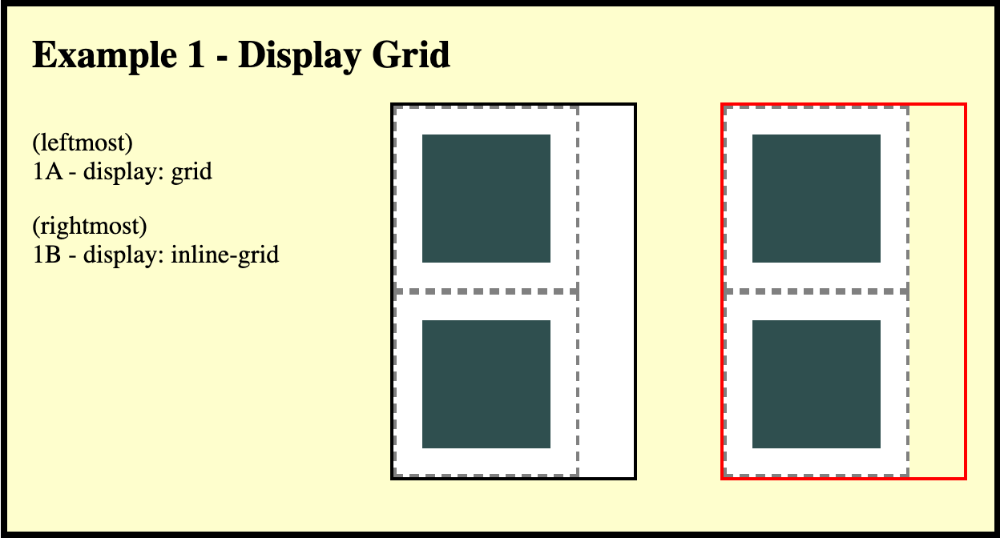
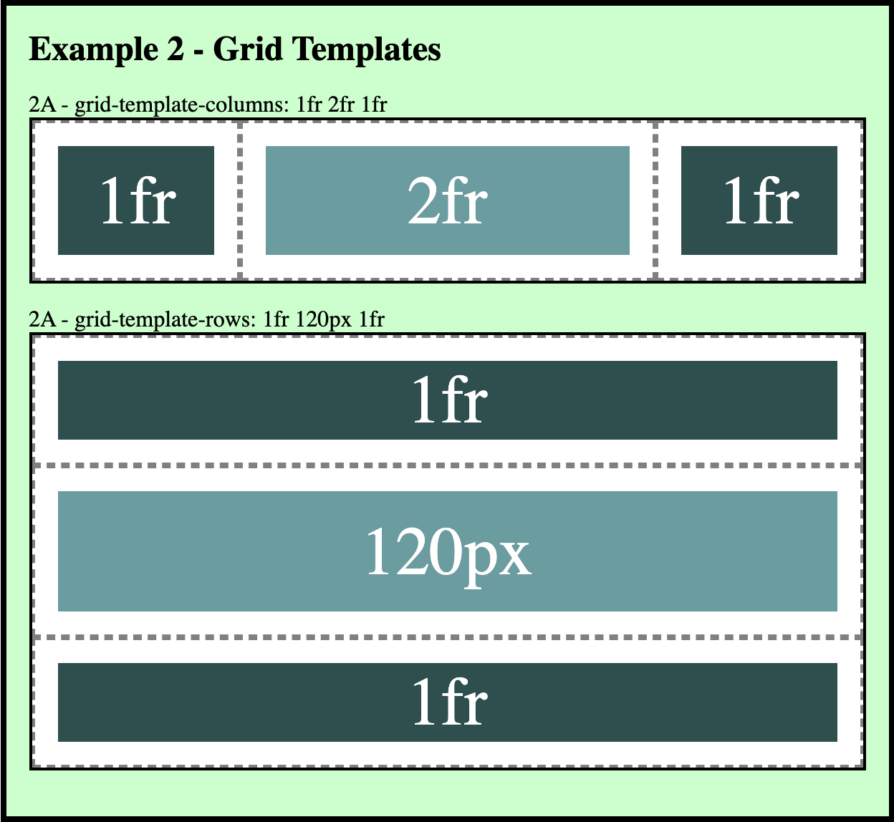
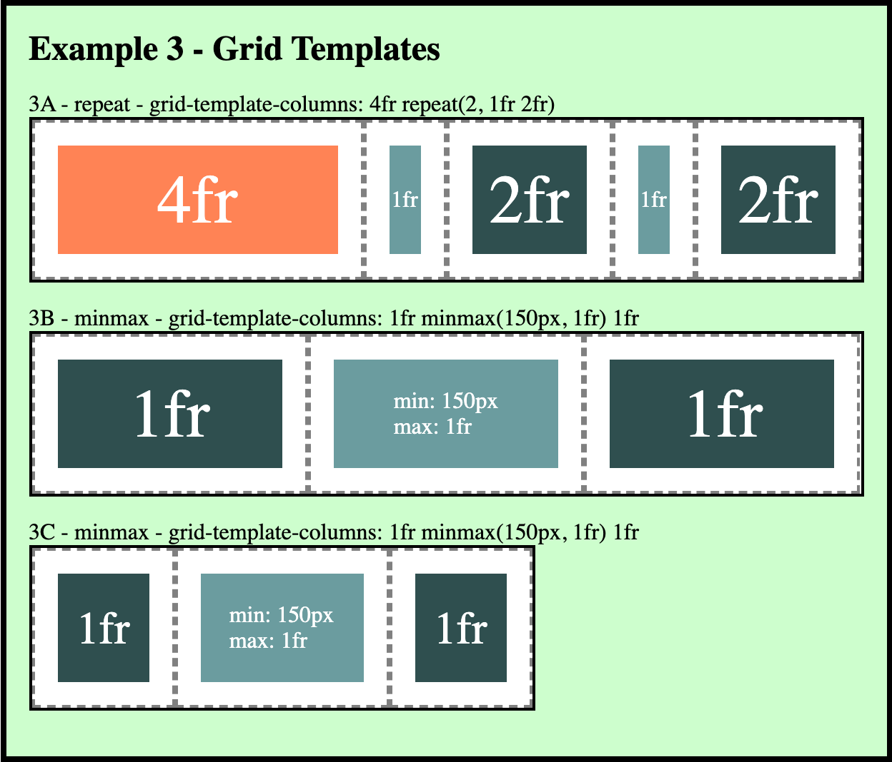
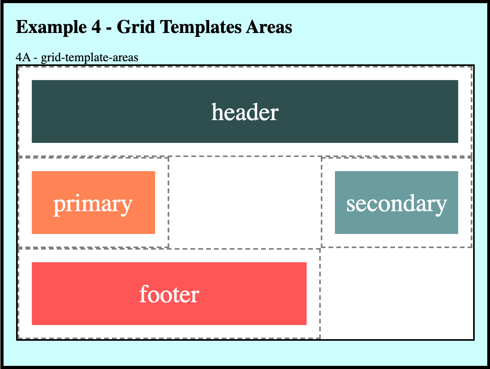
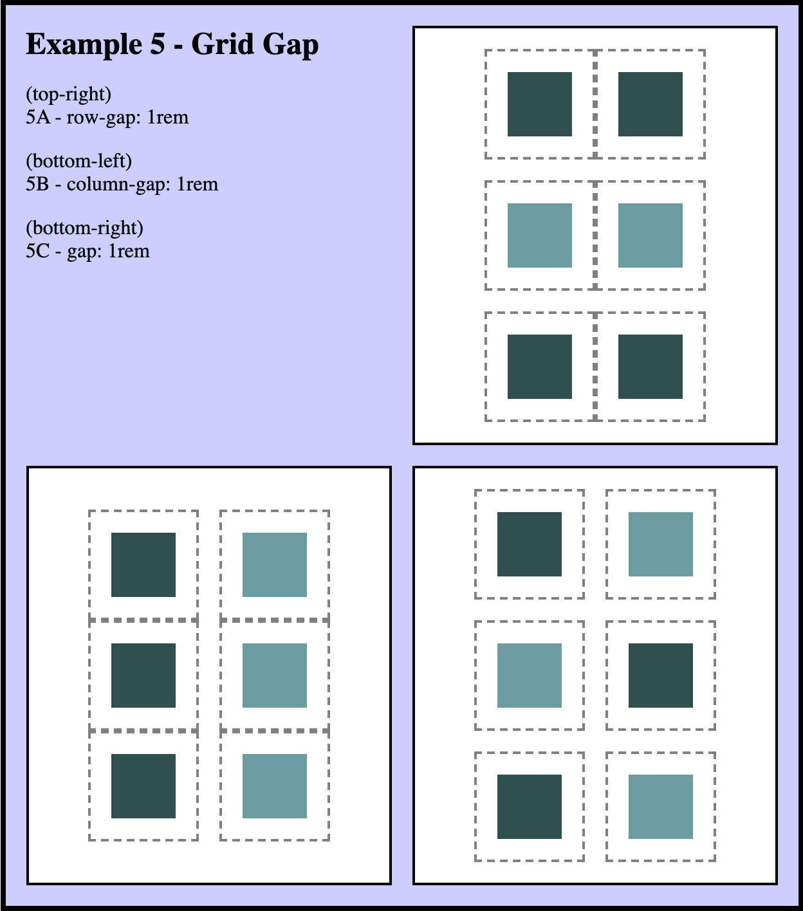
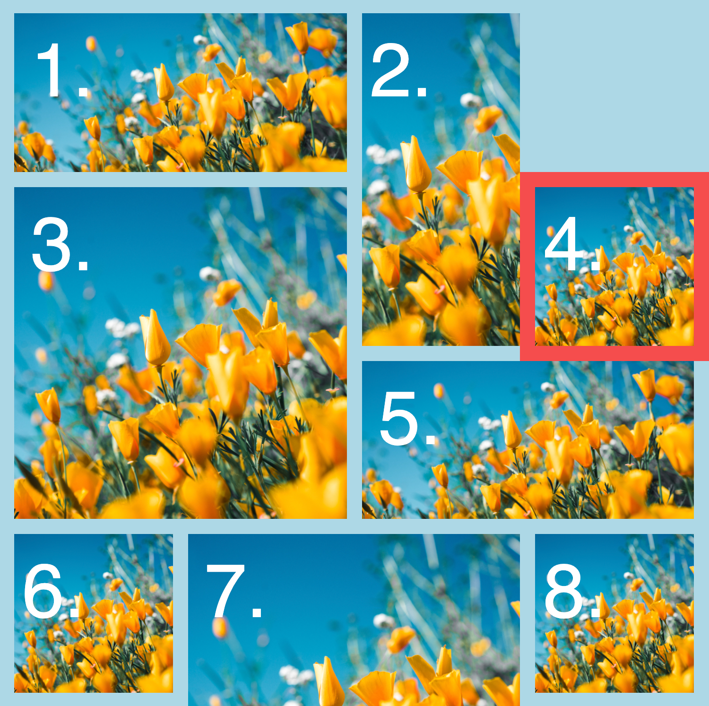
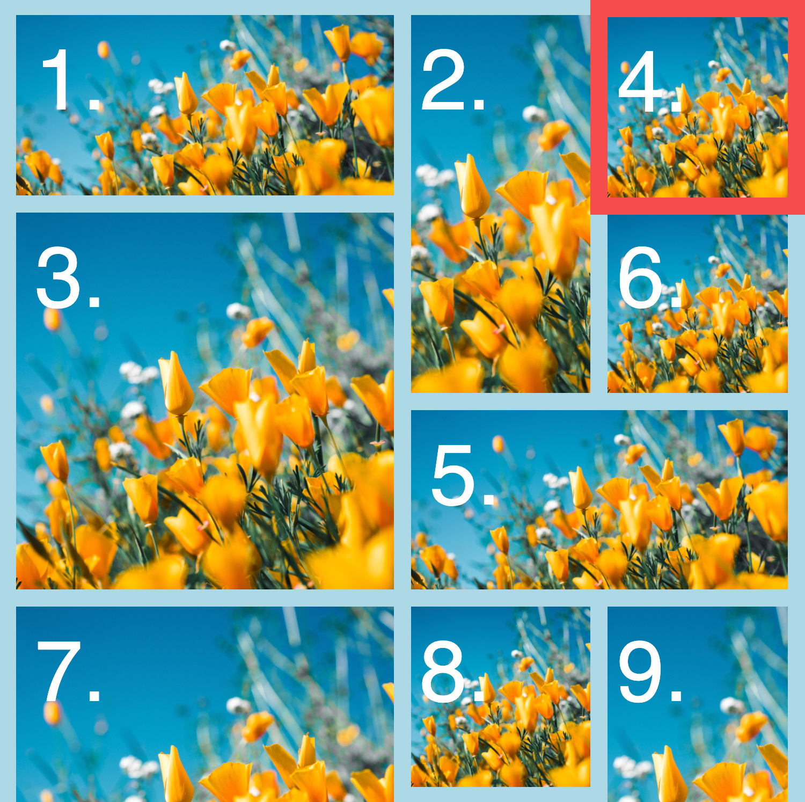
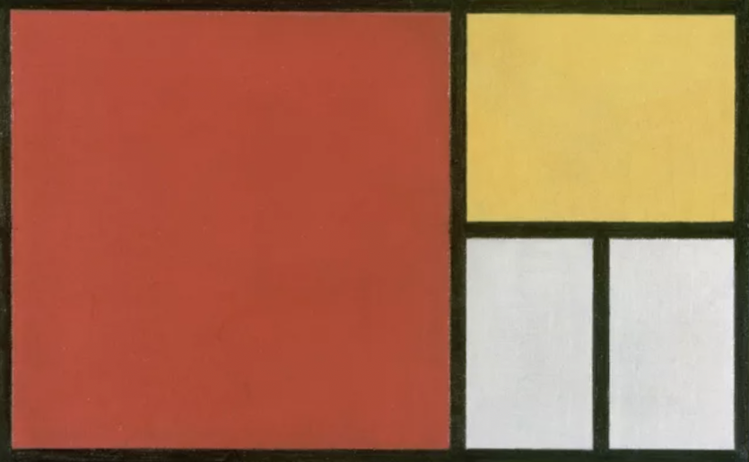
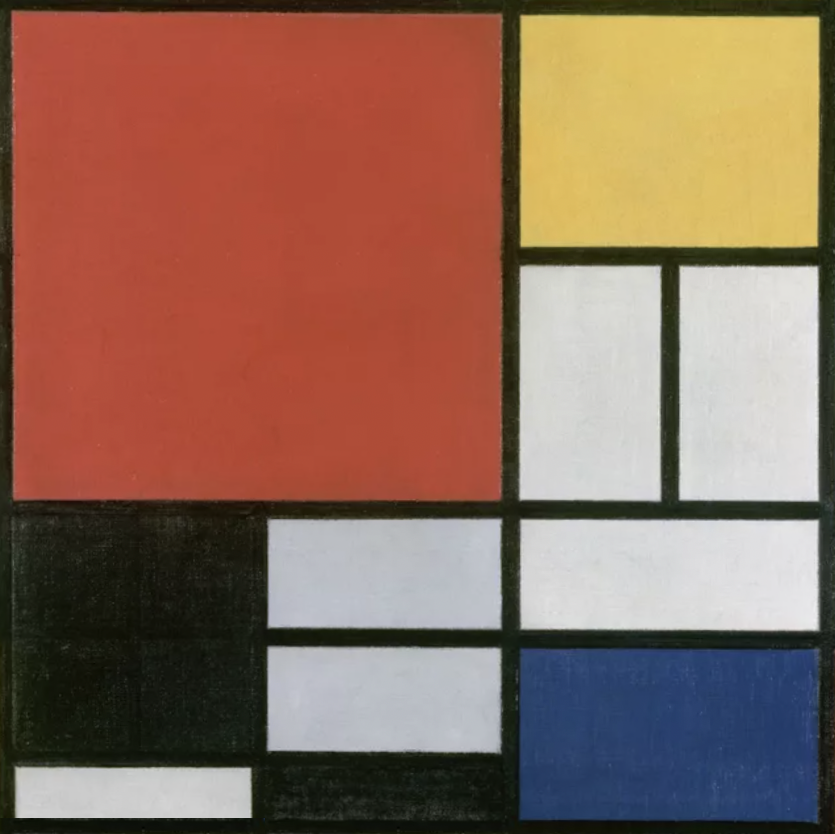

# BNTA Course Notes

## CSS Grid Notes

### Introduction

You have already seen how flexbox containers can be used to create responsive and clean components for your webpage. Flexbox, however, does have it's limitations and you may at some-point be in want of a true **two-dimensional** means to organising your webpage content. This is where CSS Grid comes into play. By first setting up a system of rows and columns, you can then define where each component part sits in two dimensions, helping you build more complicated designs.

### CSS Grid

Many of the tools provided to us as web developers are more than initially meets the eye and this is true for CSS Grid. At first glance, you may think that Grid is simply a means to lining up some items within a section; however, Grid exists at more levels than that of a simple component. Entire sites can be built up a Grid at the base level (*e.g.* applying `display: grid` to the `<body>` of a webpage), and while this is uncommon, largely owing to how recently Grid was implemented fully, we may see this become part of a trend in the coming years.

As you read through this document, you may start to recognise some similarities between Flexbox and CSS Grid. I take this opportunity however to highlight that while both can be used for similar effects on your webpage, the two are intrinsically different. The difference in use-case is subtle, with Grid largely eclipsing Flexbox, however if you ask yourself "Do I want this content to statically sit beneath this other content, regardless of changing screen size?" then you glimpse the power of Grid.

[CSS Tricks - A Complete Guide to Grid](https://css-tricks.com/snippets/css/complete-guide-grid/)

## Grid Properties

### display: grid

**[ grid / inline-grid ]**

[https://developer.mozilla.org/en-US/docs/Learn/CSS/CSS_layout/Grids]()

As with Flexbox, Grid starts with the parent container. Applying `display: grid` to the parent deems it a *Grid Container* which will automatically start organising each discrete code block into a grid row. `display: grid` will create these rows to the width of the parent container whereas `display: inline-grid` will create the rows at the minimum width required to contain the content of the grid items.



### Grid Template *(the explicit grid)*

**[ # / fr / repeat(#, #) / minmax(#, #) ]**

Definition of the ***explicit grid*** and the automatic organisation of the content within it is where Grid really shines. With use of the `grid-template` properties, `grid-template-columns`, `grid-template-rows` and `grid-template-areas`, you can define the spatial organisation of your grid before it is populated with content. When you later play about with the positioning properties of `grid-column` and `grid-row`, you can even specify columns or rows which do not exist within your Grid template. The placement of these items and the automatic creation of extra grid tracks establishes the creation of the ***implicit grid***. The combination of the explicit and implicit grids is what is displayed as part of your webpage and mastering the interplay between the two will set you up well as a web developer.

[CSS Tricks - The Difference Between Explicit and Implicit Grids](https://css-tricks.com/difference-explicit-implicit-grids/) 

#### grid-template-columns & grid-template-rows

[https://developer.mozilla.org/en-US/docs/Web/CSS/grid-template-columns]()

To define the number and size of the tracks within the ***explicit*** grid we use `grid-template-columns` and `grid-template-rows`. Both properties accept a list of space-separated values defining each track, in order. You can also optionally name the beginning placement of each space by enclosing the name within *[square brackets]* between the relevant tracks in the template declaration. (*e.g.* `grid-template-columns: [grid_start] 100px [column2-name] 100px [col3-start] 100px`) If the track is not explicitly given a name then it will be assigned one based on its index, **from index 1**.



There are a few handy pieces of notation which substantially bolster the usability, and robustness, of CSS Grid:

- Fractional units (fr)

	Fractional units are incredibly useful when creating a grid template as they allow you to easily create tracks with sizes equal, or proportional to, one-another. They are used in the form: `grid-template-columns: 1fr 2fr 1fr`; with the Grid template assignment properties. Note here that the second column would fill double the space of the first and third columns. When using fractional units alongside static unit declarations, such as those in pixel or rem, the ratio of the fractional units defines the distribution of the ***remaining free space*** in the grid complex. 
	


- `repeat(#, #)`
	`repeat` is another incredibly useful piece of notation which you can use with Grid. If you have a grid layout which follows a simple, repeating pattern then you do not need to specify the size of each track individually. This is especially useful for when using large grid structures. You can even include repeating units as only part of your grid template where you may, for instance, want the outer bounding columns to be of a different width. The repeating unit can also include multiple track declarations within itself.
	
- `minmax(min#, max#)`
	Although there are a number of similarities, comparing CSS Grid to Flexbox may lead you to believe that Flexbox garners the edge on responsiveness, when this may not be the case. The `minmax` unit is CSS Grid's answer to combined variable screen dimensions and static design elements. As the name would suggest, the `minmax` unit allows us to set both the minimum and maximum sizes for the element, which can vary based on screen-size by the inclusion of proportional units (`#%`).
	
#### grid-template-areas

[https://developer.mozilla.org/en-US/docs/Web/CSS/grid-template-areas]()

Another property which we can use to organise our grid structure prior to the addition of content is `grid-template-areas`. Through the use of a collection of strings, we can define discrete areas which we can later refer to, to better organise our content without worrying about which column or row to point towards. Each row is defined within a block quote (within a set of `"` quotes), with the area name provided for each cell. An empty cell is denoted with a full-stop `.`. Your area declaration must be rectangular to be valid. Note that the grid lines between regions are automatically generated as ***nameOfArea-start*** and ***nameOfArea-end***. This means that each grid-line may have multiple names, any of which you may use.



```
<section id="example4_A" class="example">
    <div class="box header" >header</div>
    <div class="box primary" >primary</div>
    <div class="box secondary" >secondary</div>
    <div class="box footer" >footer</div>
</section>
```

```
#example4_A {
    display: grid;
    grid-template-columns: 1fr 1fr 1fr;
    grid-template-rows: 1fr 1fr 1fr;
    grid-template-areas: 
        "header header header"
        "primary . secondary"
        "footer footer .";
}

#example4_A > header {
	background-color: rgb(47, 79, 79);
	grid-area: header;
}

etc.
```


#### grid-template

[https://developer.mozilla.org/en-US/docs/Web/CSS/grid-template]()

A `grid-template` property exists which encompasses the `grid-template-columns`, `grid-template-rows` and `grid-template-areas` properties under one name. The syntax can be fairly difficult to get your head around however so we won't be covering it here in any depth. If you are curious about how the property declaration looks then please find the MDN documentation linked above.


#### grid-auto-column & grid-auto-row

[https://developer.mozilla.org/en-US/docs/Web/CSS/grid-auto-columns]()

`grid-auto-column` and `grid-auto-row` are two properties which relate to the ***implicit grid***. When an item is placed in this implicit grid, either by being positioned out-of-bounds or simply by the grid expanding to accommodate a growing number of items, then this item's track bounds are set by these properties. The default value is `auto` which aligns with the minimum width required to accommodate the largest item in the implicit track.


### gap

**[ # / % ]**

[https://developer.mozilla.org/en-US/docs/Web/CSS/gap]()

The spacing between items in the total grid (implicit and explicit grids) can be defined by the `gap` property. Any positive numerical value is accepted, with percentage values being based off the size of the element (as opposed to the parent). The `gap` property is a combination of the `row-gap` and `column-gap` properties.



#### grid-auto-flow

**[ row / column / dense ]**

[https://developer.mozilla.org/en-US/docs/Web/CSS/grid-auto-flow]()

Now that we have defined the means to set up our grid structure, we can consider how we affect the placement of Grid items within said grid. By default, Grid items will organise themselves into the explicit grid in the order left-right, top-bottom relative to the order in the HTML markup. Providing that each item is of equal size, then the resulting grid will be regular and ordered.

There are times, however, when we want something more exciting than a simple array of regularly-sized items. For instance, perhaps we would like some items to span a number of rows or columns—an action with would disrupt the usual ordering of the grid and likely cause gaps to appear. Applied to the grid container, `grid-auto-flow` can be used to override this ordering on an overall but by-item basis to better align the organisation with what you want from your content:

- `grid-auto-flow: row` is the default value for `grid-auto-flow` and will organise the grid items in left-right top-bottom fashion. The grid will expand to add extra rows as needed.

- `grid-auto-flow: column` organises the grid items in top-bottom left-right order. This means that it attempts to fill a column before moving on to the next one. The grid will expand to add extra columns as needed.

- `grid-auto-flow: dense` is a really cool property. When there would be a hole left in the grid that a later Grid item could fill, then `grid-auto-flow: dense` will allow that item to break the overall ordering of the grid to fill that gap. The below images show an example of this broken ordering for a `grid-auto-flow: row dense` container. Note how Box #4 (highlighted) moved from the end of the second row to fill the space left in Row 1, creating a more complete grid shape.


	

(left) A generated grid system with varying box sizings and default `grid-auto-flow: row`<br/>(right) A generated grid system with varying box sizings and `grid-auto-flow: row dense` applied

### Grid Item Columns & Rows

**[ # / span ]**

[https://developer.mozilla.org/en-US/docs/Web/CSS/grid-column]()

If you require a bit more control over the position or relative size of your grid items, then there are a selection of properties you can set. Many of these properties make use of a new piece of syntax: `span`. The `span` syntax is handy for when you know the exact placement of your grid item(s). Coupled with either a positive integer number or a line name, the `span` syntax can be use to assign the space for a grid item with ease. If a line name is provided as the value following `span` then the grid item spans across all tracks until it hits the line specified.

- `grid-column-start` defines the starting column placement for the grid item by specifying the ***line name*** of where it is to start. The use of the `span` syntax (*e.g.* `grid-column-start: 1 span 2`) may invalidate the need for the following `grid-column-end` property

- `grid-column-end` defines the ending bounds of a grid item by providing the line-name

- `grid-row-start` and `grid-row-end` work the same as above but for rows in place of columns

Similar to other properties we have seen throughout the past documents, these properties can be defined using combined property names to save on code. `grid-column` and `grid-row` work as you would expect them two, taking their two respective properties defined above and placing them under one roof. They use another piece of syntax which we haven't encountered yet, which is the `/` syntax. This is simply a means for separating the values provided and assigning them to the corresponding properties. For instance `grid-column: 2 / 4` breaks down to `grid-column-start: 2` and `grid-column-end: 4`.

Lastly, `grid-area` does what it says on the tin and simply assigns the grid item to the specified grid-area as defined using `grid-template-areas` or `grid-template`. For an example of how to assign the area, please see the example code in the `grid-template-areas` section above.

## A Note on Properties from Flexbox

**[start / end / center / stretch]**

CSS Grid in many ways is coupled to Flexbox and so the two often work well together and sometimes share property declarations. You can hence loosely consider a `display: grid` container as a `display: flex` container and use the positioning properties outlined in the previous document. Some of the more commonly used properties are outlined below:

- `justify-items` is used to align the grid items along the ***inline (row)*** axis and hence sets the alignment of each item **within** it's grid cell. Individual items can be set using the `justify-self` property. 

- `align-items` is used the position the grid items on the ***block (cross / column)*** axis.

- `place-items` is a combination property which includes both `align-items` and `justify-items`. Again, the `/` syntax is used here to separate the two values provided within one declaration.

It should be noted that `justify-content`, `align-content` and their related `place-content` property do also apply to Grid containers, specifically those where the grid size is less than the size of the grid container. Proper use of the `stretch` value here can be powerful when creating responsive design elements, however it may be infrequent that you encounter this use-case. The CSS Tricks article linked at the top of the document does a great job visually displaying how there properties behave.

## Practice

As with everything, new topics make more sense once we get hands-on and start practising. There are a couple tasks we are recommending you spend some time with to practice using CSS Grid. The first is the CSS Grid compliment to Flexbox Froggy, CSS Grid Garden, where the aim is to water your crops and poison weeds by specifying the CSS Grid properties and values needed. 

[CSS Grid Garden game](https://cssgridgarden.com/)

The second task allows you a bit more hands-on experience. In this task, we are asking you to construct a portion of a Piet Mondrian painting using only HTML and CSS. You can use either local files or a site such as [CodePen](https://codepen.io/) for this exercise. If you feel like you want a higher degree of accuracy than eye-balling the image will allow then under the Firebox Developer Tools section, you can toggle the *"Measure a portion of the page"* option for access to an browser ruler. You may find opening the image in a new tab may help.

(Thank you to Jen Kramer for the inspiration of this practice exercise)



Start with the above example with only four blocks and then attempt the second image for further practice.



## Further Reading

[MDN Documentation - Grid](https://developer.mozilla.org/en-US/docs/Web/CSS/grid)

[CSS Tricks - A Complete Guide to Grid](https://css-tricks.com/snippets/css/complete-guide-grid/)

[Free Code Camp - A Beginner’s Guide to CSS Grid](https://www.freecodecamp.org/news/a-beginners-guide-to-css-grid-3889612c4b35/)

[https://learncssgrid.com/]()

