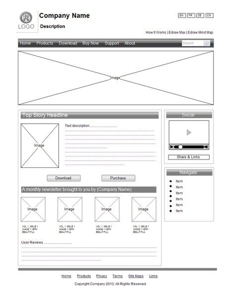
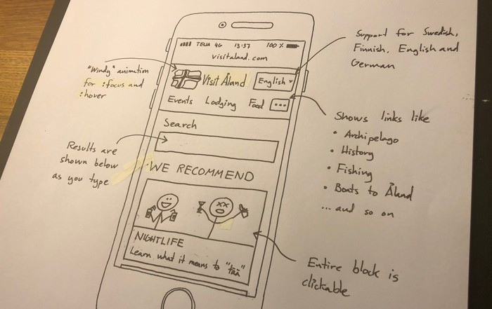
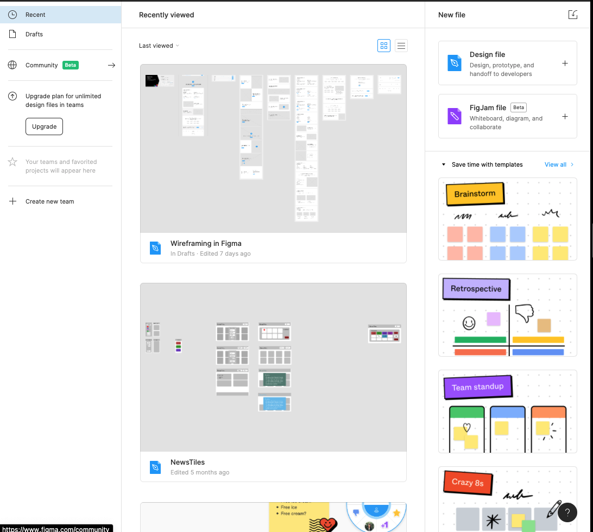

# Wireframes

## Table of contents

- [What are they?](#what-are-they)
- [Why are they used?](#why-are-they-used)
- [How to create them](#how-to-create-them)

## What are they?

- Wireframes are essentially a visual blueprint or skeletal outline of a webpage.
- A wireframe generally represents a product concept so normally feature no colours, styling or graphics - these are called low fidelity wireframes meaning low precision. 
- They simply include boxes and text to provide a layout of the structure of a webpage.

- A wireframe: 
  - Contains the main site information
  - Illustrates the outline of structure and layout
  - Visual representation and description of User Interface (UI)

## Why are they used?

- Wireframes are a way to design a website at a structural level so that the User Interface (UI) and User Experience (UX) can be focused on.
- In development teams where programmers, designers and stakeholders are present, wireframes also allow for the structure to be communicated and agreed on before more detailed mock ups are drawn up.

## How to create them? 

- Wireframes can simply be drawn on pen and paper.

- Otherwise, prototyping tools like Figma can be used to wireframe

- Figma is a powerful prototyping tool and can be used to create basic wireframes like in the above picture or more detailed mockups.
- Here is a tutorial to guide you through creating more detailed wireframes if you are interested: https://www.youtube.com/watch?v=6t_dYhXyYjI