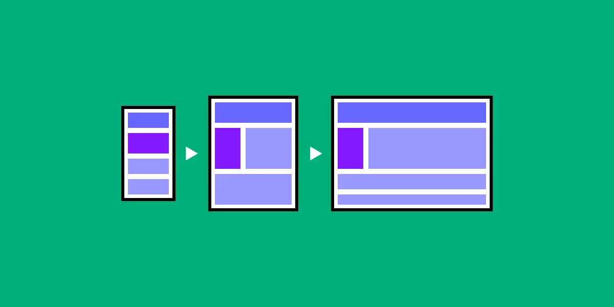

# Mobile First Design

## Table of contents

- [What is it?](#what-is-it)
- [Why is it done?](#why-is-it-done)
- [How is it done?](#how-is-it-done)

## What is it?

- Mobile-first design is exactly as it sounds, designers and developers work on the smallest screen first and then work their way up.

## Why is it done?

- The idea behind the mobile-first approach is of progressive enhancement. 
- In this way a "mobile-first approach" differs from "desktop-first" in that information is added to each progressively larger layout rather than cut away as the designs are made smaller.
- It is the idea that mobile design, as the hardest, should be done first.
- What it boils down to is that, the smallest of the designs will have only the essential features so the heart of your UI and UX is designed straight away.
- Due to the limitations of the screen size of a mobile the approach forces designers to prioritize the most important content for your page.

## How is it done? 

- Wireframing is recommended as an early step to most efficiently structure your layout.
- In a true mobile-first approach, designers will wireframe the movile view first before the tablet view and lastly they will design the desktop view.
- After the designs are set, programmers develop the mobile design first.
- They then stretch the page until there is too much white space, at this point developers insert media queries in to their pages CSS to resize text, containers and adjust layout.

- Let's see how this works