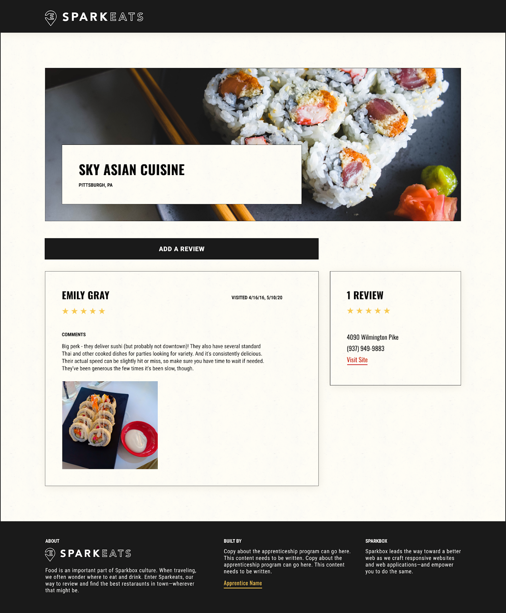
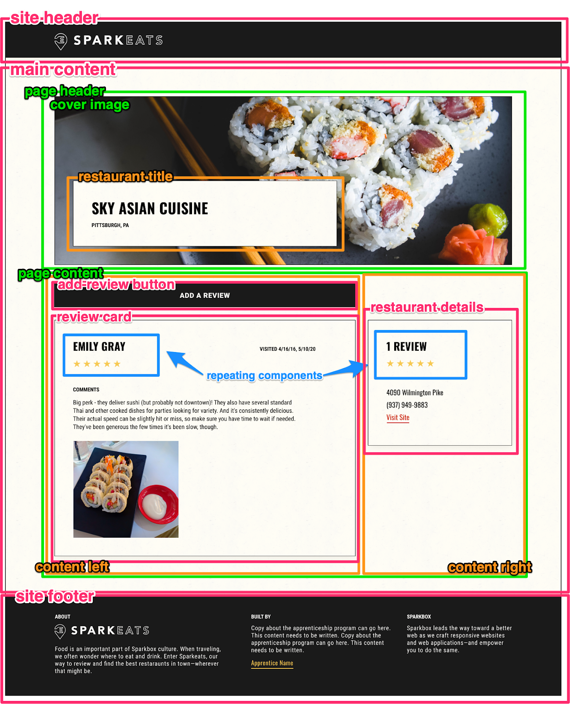

# Decomp

## Table of contents

- [What is it?](#what-is-it)
- [Why is it done?](#why-is-it-done)
- [How is it done?](#how-is-it-done)

## What is it?

- Decomp or decomposition is the process of breaking your website into small manageable components
- Once you have a wireframe or mock up design like below, the next step is to draw boxes around each section or "block" on the page.

### Before Decomp

### After Decomp

- The idea is to capture functional blocks of your website e.g your header or navbar

## Why is it done?

- Full designs of websites can be overwhelming. Breaking the a website down in to components makes the work more manageable and easier to share out.
- It also helps the development team to understand the scope of the work that needs to be done as well as created Kanban board tickets to track the works progress.

## How is it done? 

- Huffington Post Decomp Exercise