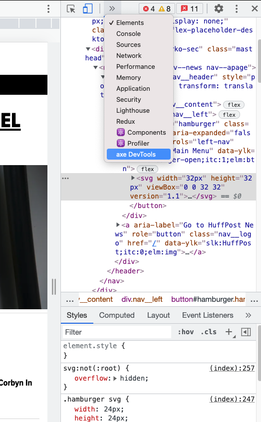
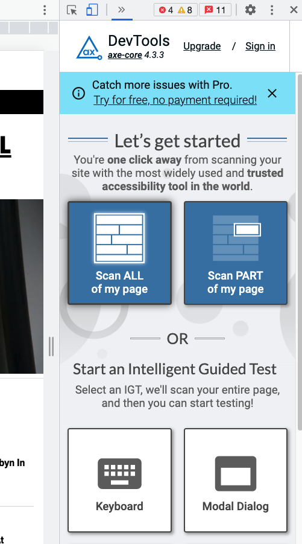

# HuffPost Clone - Logo To Header Finish

## Objectives

- Using aria-label and role for accessibility
- Completed Header
- Screen Reader run through
- Axe DevTools
- 1st Commit


## Table of contents

- [Using aria-label and role for accessibility](#aria-and-role-for-accessibility)
- [Completed Header](#completed-header)
- [Axe DevTools](#axe-devtools)
- [1st Commit](#1st-commit)


## Using aria-label and role for accessibility

- We saw previously what aria-label and role are used for but let's see them in use in another example

```
<a aria-label="Go to HuffPost News" role="button" href="https://www.huffingtonpost.co.uk/">
```

- Above is the anchor tag that wraps around our logo svg
- We are using the aria-label attribute to tell a non-sighted user where they will be taken to upon interacting with our logo
- In this instance we've altered the default role of the anchor tag from a link to being a button.

## Completed Header

```
<header class="header" style="position: relative; transform: translateY(0px);">
  <nav class="nav">
    <button id="hamburger" class="hamburger" aria-expanded="false" aria-label="Main Menu">
      <svg width="32px" height="32px" viewBox="0 0 32 32" version="1.1">
        <g id="Symbols" stroke="none" stroke-width="1" fill="none" fill-rule="evenodd">
          <g id="menu">
            <g id="Page-1" transform="translate(1.000000, 6.000000)">
              <g id="Group-3" transform="translate(0.000000, 0.335443)">
                <path
                  d="M29.8136571,1.58382857 C29.8136571,0.760542857 29.1463714,0.0932571429 28.3230857,0.0932571429 L1.49065714,0.0932571429 C0.667371429,0.0932571429 8.57142857e-05,0.760542857 8.57142857e-05,1.58382857 C8.57142857e-05,2.40711429 0.667371429,3.0744 1.49065714,3.0744 L28.3230857,3.0744 C29.1463714,3.0744 29.8136571,2.40711429 29.8136571,1.58382857"
                  id="Fill-1" fill="#000000"></path>
              </g>
              <g id="Group-6" transform="translate(0.000000, 8.478300)">
                <path
                  d="M29.8136571,1.54654286 C29.8136571,0.723257143 29.1463714,0.0559714286 28.3230857,0.0559714286 L1.49065714,0.0559714286 C0.667371429,0.0559714286 8.57142857e-05,0.723257143 8.57142857e-05,1.54654286 C8.57142857e-05,2.36982857 0.667371429,3.03711429 1.49065714,3.03711429 L28.3230857,3.03711429 C29.1463714,3.03711429 29.8136571,2.36982857 29.8136571,1.54654286"
                  id="Fill-4" fill="#000000">

                </path>
              </g>
              <g id="Group-9" transform="translate(0.000000, 16.621157)">
                <path
                  d="M29.8136571,1.5093 C29.8136571,0.686014286 29.1463714,0.0187285714 28.3230857,0.0187285714 L1.49065714,0.0187285714 C0.667371429,0.0187285714 8.57142857e-05,0.686014286 8.57142857e-05,1.5093 C8.57142857e-05,2.33258571 0.667371429,2.99987143 1.49065714,2.99987143 L28.3230857,2.99987143 C29.1463714,2.99987143 29.8136571,2.33258571 29.8136571,1.5093"
                  id="Fill-7" fill="#000000">

                </path>
              </g>
            </g>
          </g>
        </g>
      </svg>
    </button>

    <a aria-label="Go to HuffPost News" role="button" href="https://www.huffingtonpost.co.uk/">
      <svg class="nav__logo" version="1.1" x="0px" y="0px" viewBox="0 0 720 90" xml:space="preserve" width="176px">
        <g id="Layer_1">
          <g>
            <g>
              <path class="st2"
                d="M93.1,85.4h26.3l14.1-80.7h-26.3L102,33.6H79.2l5.2-28.9H58.1L44,85.4h26.3l5.3-30.2h22.8L93.1,85.4z"
                fill="#ffffff"></path>
            </g>
            <g>
              <path class="st2" d="M148.4,4.6l-8,44.9c-0.7,3.5-1,6.9-1,10.1c0,23.8,20.8,27.4,33.3,27.4c26.2,0,37.5-8.7,41.6-32.2l8.8-50.3
        h-26.3l-7.5,42.2c-2.4,13.2-4.1,20.1-13.9,20.1c-6.4,0-9.5-3.4-9.5-10.4c0-2.7,0.4-6,1.2-10.1l7.6-41.8H148.4z"
                fill="#ffffff"></path>
            </g>
            <g>
              <path class="st2" d="M362.1,85.4h26.3l3.7-20.8h12.4c22.9,0,35.6-12.4,35.6-35c0-15.9-11-25-30.3-25h-33.6L362.1,85.4z
          M403.1,44.7h-7.6l3.5-19h7.1c5.8,0,8.9,2.9,8.9,8.2C415,40.6,410.5,44.7,403.1,44.7z" fill="#ffffff"></path>
            </g>
            <g>
              <path class="st2" d="M491.2,2.9c-28.6,0-45.7,18.5-45.7,49.6c0,21.6,13.6,34.6,36.4,34.6c28.6,0,45.7-18.5,45.7-49.6
        C527.7,15.8,514.1,2.9,491.2,2.9z M483.5,66.2c-6.8,0-10.8-4.9-10.8-13.1c0-3.1,0.3-5.8,0.9-8.9c2-10.6,5.4-20.3,16.1-20.3
        c6.8,0,10.8,4.9,10.8,13.1c0,3.1-0.3,5.8-0.9,8.9C497.6,56.4,494.2,66.2,483.5,66.2z" fill="#ffffff"></path>
            </g>
            <g>
              <path class="st2" d="M619.1,85.4h26.3l10.4-59.1h19.8l3.8-21.6h-67.3l-3.8,21.6h21L619.1,85.4z"
                fill="#ffffff"></path>
            </g>
            <path class="st2" d="M575.5,34.5c-8.3-2.6-11.7-3.7-11.7-7.6c0-2.6,1.7-5.7,6.7-5.7c3.7,0,6.8,2.1,8,5.2l23.2-6.3
      c-2.7-11.4-12.5-17.2-29.4-17.2c-31.8,0-34.3,21.3-34.3,27.8c0,13.2,7,21.3,22.2,25.5c4,1.1,8.6,2.3,8.6,6.7
      c0,3.5-2.6,5.7-7.1,5.7c-4.1,0-8.5-2.4-10-6.6l-22.9,6.2c2.5,12,13.8,18.8,31.5,18.8c13.5,0,36.1-3.6,36.1-28
      C596.5,46.8,589.6,38.8,575.5,34.5z" fill="#ffffff"></path>
            <g>
              <path class="st3" d="M29.3,85.4L43.5,4.7H0v80.7L29.3,85.4z" fill="#0dbe98"></path>
            </g>
            <g>
              <path class="st3" d="M690.7,4.7l-14.1,80.7l43.5,0V4.7L690.7,4.7z" fill="#0dbe98"></path>
            </g>
            <polygon class="st2" points="238.1,4.6 224,85.4 250.3,85.4 254.5,61.6 276.6,61.6 280.2,41.3 258.1,41.3 260.6,26.3 291.5,26.3
      295.3,4.6 		" fill="#ffffff"></polygon>
            <polygon class="st2" points="307.1,4.6 293,85.4 319.3,85.4 323.4,61.6 345.6,61.6 349.2,41.3 327.1,41.3 329.6,26.3 360.5,26.3
      364.3,4.6 		" fill="#ffffff"></polygon>
          </g>
        </g>
      </svg>
    </a>

  </nav>
</header>
```

- Now if we run through with a Screen Reader we can see how our website works but how sure can we be that we are not breaking any accessibility guidance

## Axe DevTools

- Luckily there exists accessiblity checkers that we can use to find and fix any accessibility issues during development.
- One of these tools is axe DevTools which is a google chrome extension.

[Axe DevTools Chrome](https://chrome.google.com/webstore/detail/axe-devtools-web-accessib/lhdoppojpmngadmnindnejefpokejbdd)
[Axe DevTools Firefox](https://addons.mozilla.org/en-GB/firefox/addon/axe-devtools/)


To use Axe DevTools in Chrome:
- open inspect element in chrome or developer tools
- click the double arrow at the top of the dev tools window seen below



- Then select Axe DevTools
- Click Scan Page as seen below and Axe DevTools will check your website for any accessibility issues



## 1st Commit

- Now we have completed our header ticket, we are ready to commit our work to version control

- To do that we first make sure we are in a folder high enough up the directory tree to contain all of the changes we have made.

- We then add our files to staging, this is like a limbo land where work is waiting to be committed. We do this with the command:

```
git add .
```

- This adds all the changes to files in the current folder as well as the folders children to the staging area.

- We can check what files have been added to the staging area with the command:

```
git status
```

- Now that we have checked that our files have been added to the staging area, we can commit with the command:

```
git commit -m "Add Header including hamburger main menu and HuffPost Logo"
```

- We can check that our commit worked with the command:

```
git log --oneline 
```

- And finally we can push to our github repo using the command:

```
git push -u origin main
```