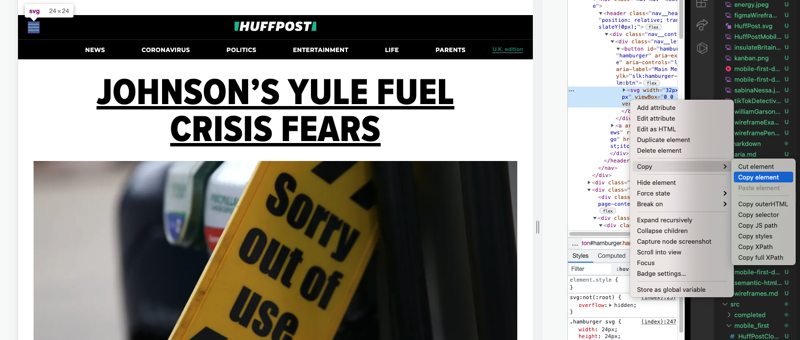

# HuffPost Clone - Starting Point - Header To Hamburger

## Objectives

- Initialise as git repository
- Emmet Abbreviation
- Copy Hamburger SVG
- Bad Hamburger
- Better Hamburger
- Good Hamburger

## Table of contents

- [Initialise as git repository](#git-repo)
- [Emmet Abbreviation](#emmet)
- [Copying an SVG from a Webpage](#copy-svg)
- [Bad Hamburger](#bad-hamburger)
- [Better Hamburger](#better-hamburger)
- [Good Hamburger](#good-hamburger)

## Initialise as Git Repository

To create a new folder:

```
mkdir HuffPostClone
```

When you create a new folder that is going to contain your project you should initialise it as a git repo:

```
git init
```

If you have already a created a github repository, you can link the local version to the online github repository by typing something similar to:

```
git remote add origin https://github.com/darrenm95/HuffPostClone.git
```

After that is done we can make commits as we go along to version control our project and then push our changes to the local repository to the github repository which you'll see later.

## Emmet Abbreviation

- Emmet abbreviations are shortcuts that when typed in a .html file within vscode will be expanded in to a code block.

If you type:
```
!
```

Then hit enter or the tab key (whilst within a .html file), it will expand in to the code below:

```
<!DOCTYPE html>
<html lang="en">
<head>
  <meta charset="UTF-8">
  <meta http-equiv="X-UA-Compatible" content="IE=edge">
  <meta name="viewport" content="width=device-width, initial-scale=1.0">
  <title>Document</title>
</head>
<body>
  
</body>
</html>
```
## Copying an SVG from a Webpage

You can copy svgs from webpages by inspecting the svg element, right clicking, going to copy and then copy element as the image below shows.



## Bad Hamburger

```
<div id="hamburger" class="hamburger" tabindex="0">
  <svg width="32px" height="32px" viewBox="0 0 32 32" version="1.1">
    <g id="Symbols" stroke="none" stroke-width="1" fill="none" fill-rule="evenodd">
      <g id="menu">
         <g id="Page-1" transform="translate(1.000000, 6.000000)">
          <g id="Group-3" transform="translate(0.000000, 0.335443)">
            <path
                d="M29.8136571,1.58382857 C29.8136571,0.760542857 29.1463714,0.0932571429 28.3230857,0.0932571429 L1.49065714,0.0932571429 C0.667371429,0.0932571429 8.57142857e-05,0.760542857 8.57142857e-05,1.58382857 C8.57142857e-05,2.40711429 0.667371429,3.0744 1.49065714,3.0744 L28.3230857,3.0744 C29.1463714,3.0744 29.8136571,2.40711429 29.8136571,1.58382857"
                id="Fill-1" fill="#000000">
            </path>
          </g>
          <g id="Group-6" transform="translate(0.000000, 8.478300)">
            <path
              d="M29.8136571,1.54654286 C29.8136571,0.723257143 29.1463714,0.0559714286 28.3230857,0.0559714286 L1.49065714,0.0559714286 C0.667371429,0.0559714286 8.57142857e-05,0.723257143 8.57142857e-05,1.54654286 C8.57142857e-05,2.36982857 0.667371429,3.03711429 1.49065714,3.03711429 L28.3230857,3.03711429 C29.1463714,3.03711429 29.8136571,2.36982857 29.8136571,1.54654286"
              id="Fill-4" fill="#000000">
            </path>
          </g>
          <g id="Group-9" transform="translate(0.000000, 16.621157)">
            <path
              d="M29.8136571,1.5093 C29.8136571,0.686014286 29.1463714,0.0187285714 28.3230857,0.0187285714 L1.49065714,0.0187285714 C0.667371429,0.0187285714 8.57142857e-05,0.686014286 8.57142857e-05,1.5093 C8.57142857e-05,2.33258571 0.667371429,2.99987143 1.49065714,2.99987143 L28.3230857,2.99987143 C29.1463714,2.99987143 29.8136571,2.33258571 29.8136571,1.5093"
              id="Fill-7" fill="#000000">

            </path>
          </g>
        </g>
      </g>
    </g>
  </svg>
</div>
```

## Better Hamburger

```
<button id="hamburger" class="hamburger">
  <svg width="32px" height="32px" viewBox="0 0 32 32" version="1.1">
    <g id="Symbols" stroke="none" stroke-width="1" fill="none" fill-rule="evenodd">
      <g id="menu">
        <g id="Page-1" transform="translate(1.000000, 6.000000)">
          <g id="Group-3" transform="translate(0.000000, 0.335443)">
            <path
              d="M29.8136571,1.58382857 C29.8136571,0.760542857 29.1463714,0.0932571429 28.3230857,0.0932571429 L1.49065714,0.0932571429 C0.667371429,0.0932571429 8.57142857e-05,0.760542857 8.57142857e-05,1.58382857 C8.57142857e-05,2.40711429 0.667371429,3.0744 1.49065714,3.0744 L28.3230857,3.0744 C29.1463714,3.0744 29.8136571,2.40711429 29.8136571,1.58382857"
              id="Fill-1" fill="#000000"></path>
          </g>
          <g id="Group-6" transform="translate(0.000000, 8.478300)">
            <path
              d="M29.8136571,1.54654286 C29.8136571,0.723257143 29.1463714,0.0559714286 28.3230857,0.0559714286 L1.49065714,0.0559714286 C0.667371429,0.0559714286 8.57142857e-05,0.723257143 8.57142857e-05,1.54654286 C8.57142857e-05,2.36982857 0.667371429,3.03711429 1.49065714,3.03711429 L28.3230857,3.03711429 C29.1463714,3.03711429 29.8136571,2.36982857 29.8136571,1.54654286"
              id="Fill-4" fill="#000000">

            </path>
          </g>
          <g id="Group-9" transform="translate(0.000000, 16.621157)">
            <path
              d="M29.8136571,1.5093 C29.8136571,0.686014286 29.1463714,0.0187285714 28.3230857,0.0187285714 L1.49065714,0.0187285714 C0.667371429,0.0187285714 8.57142857e-05,0.686014286 8.57142857e-05,1.5093 C8.57142857e-05,2.33258571 0.667371429,2.99987143 1.49065714,2.99987143 L28.3230857,2.99987143 C29.1463714,2.99987143 29.8136571,2.33258571 29.8136571,1.5093"
              id="Fill-7" fill="#000000">

            </path>
          </g>
        </g>
      </g>
    </g>
  </svg>
</button>
```

## Good Hamburger

```
<button id="hamburger" class="hamburger" aria-expanded="false" aria-label="Main Menu">
  <svg width="32px" height="32px" viewBox="0 0 32 32" version="1.1">
    <g id="Symbols" stroke="none" stroke-width="1" fill="none" fill-rule="evenodd">
      <g id="menu">
        <g id="Page-1" transform="translate(1.000000, 6.000000)">
          <g id="Group-3" transform="translate(0.000000, 0.335443)">
            <path
              d="M29.8136571,1.58382857 C29.8136571,0.760542857 29.1463714,0.0932571429 28.3230857,0.0932571429 L1.49065714,0.0932571429 C0.667371429,0.0932571429 8.57142857e-05,0.760542857 8.57142857e-05,1.58382857 C8.57142857e-05,2.40711429 0.667371429,3.0744 1.49065714,3.0744 L28.3230857,3.0744 C29.1463714,3.0744 29.8136571,2.40711429 29.8136571,1.58382857"
              id="Fill-1" fill="#000000"></path>
          </g>
          <g id="Group-6" transform="translate(0.000000, 8.478300)">
            <path
              d="M29.8136571,1.54654286 C29.8136571,0.723257143 29.1463714,0.0559714286 28.3230857,0.0559714286 L1.49065714,0.0559714286 C0.667371429,0.0559714286 8.57142857e-05,0.723257143 8.57142857e-05,1.54654286 C8.57142857e-05,2.36982857 0.667371429,3.03711429 1.49065714,3.03711429 L28.3230857,3.03711429 C29.1463714,3.03711429 29.8136571,2.36982857 29.8136571,1.54654286"
              id="Fill-4" fill="#000000">

            </path>
          </g>
          <g id="Group-9" transform="translate(0.000000, 16.621157)">
            <path
              d="M29.8136571,1.5093 C29.8136571,0.686014286 29.1463714,0.0187285714 28.3230857,0.0187285714 L1.49065714,0.0187285714 C0.667371429,0.0187285714 8.57142857e-05,0.686014286 8.57142857e-05,1.5093 C8.57142857e-05,2.33258571 0.667371429,2.99987143 1.49065714,2.99987143 L28.3230857,2.99987143 C29.1463714,2.99987143 29.8136571,2.33258571 29.8136571,1.5093"
              id="Fill-7" fill="#000000">

            </path>
          </g>
        </g>
      </g>
    </g>
  </svg>
</button>
```