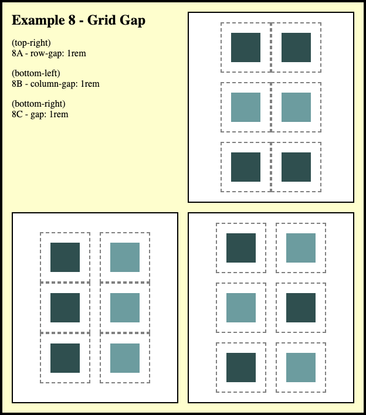

# BNTA Course Notes

## Flex Container Notes

### Introduction

Flex containers are marvellous and are used by many web developers to lay out the content of webpages. Flex allows us to create responsive designs with apparent two-dimensional organisation and has been a cornerstone advancement for web development within the last decade. Understanding how to use flex containers is a fantastic step towards creating clean and modern websites.

### CSS Flex

Back in the dark days of the web, everything was built on one axis—the one you scroll along. Horizontal layouts were possible through the use of tables and the `display: inline-block` property however effects such as consistent sizings to grouped content was difficult to achieve. Collections of elements within `` elements, a myriad of `float` properties and jumbles of interlocking JavaScript code was the accepted means to bringing interesting layout to your site—and it was fickle at best, unmaintainable at worst. *Hacks* therefore provided the main means to creating exciting layouts.

However, with the beginning of the 2010s, the web began to see a shift in how webpage content was encoded. CSS FlexBox, which later inspired `flex`, provided a complete means to creating interesting and responsive designs, or certainly encompassed what was already possible in far fewer lines of code. Dictating simply the parent container of multiple elements as a flex container with `display: flex`, it was now possible to create grid-style layouts with ease.

[CSS Tricks - A Complete Guide to FlexBox](https://css-tricks.com/snippets/css/a-guide-to-flexbox/)

## Flex Properties

### display: flex
To use flex containers, you need to first ensure that your HTML markdown is collected together into groups correctly. The parent element, such as a `<section>`, should contain all the content which shares context—such as a collection of images or products, all of which fall under one category. You can then apply the `display: flex` property to the parent element to instantiate the flex container.

### flex-direction
**[ row / column / row-reverse / column-reverse ]**

[https://developer.mozilla.org/en-US/docs/Web/CSS/flex-direction]()

Denotation of whether content is *inline* (horizontal) or *block* (vertical) type, defines how content is organised by defining the orientation of the main axis for said content. Flex containers have their own property `flex-direction` which supersedes the original `display: inline-block` functionality. 

- The default value for `flex-direction` of a flex container is `flex-direction: row` which sets the main axis horizontally, and thus the content in a row

- `flex-direction: column` will set the main axis vertically, stacking your content upon this axis similar to the default web agent property of `display: block`

- `flex-direction: row-reverse` and `flex-direction: column-reverse` function as you'd expect, organising the content of the flex container horizontally or vertically but in reverse order with respect to the HTML markup

### justify-content
**[ flex-start / flex-end / center / space-between / space-around / space-evenly ]**

[https://developer.mozilla.org/en-US/docs/Web/CSS/justify-content]()

`justify-content` allows you to specify how content is organised along the **main** axis of your flex container. Note that the main axis varies in orientation based on the `flex-direction` property (above).

- [2A] `justify-content: flex-start` is the default value for `justify-content` and sets the content clustered at the beginning of the FlexBox, with respect to the main axis

- [2B] `justify-content: center` places the items flush with each other at the center of the container

- [2C] `justify-content: flex-end`, conversely, sets the content at the end of the flex container

- [3A] `justify-content: space-between` places the maximum amount of space between each item in the row/column without any initial indent spacing and hence with items at the containers' maximum bounds

- [3B] `justify-content: space-around` places each item evenly, with the space between each item being equal. The space defined between the bounds of the container and the first flex item is half that of the space between items

- [3C] `justify-content: space-evenly` places each item evenly in the container, with the space between items, and the indent spacing between item and container bounds, being equal

There are other `justify-content` values which you can use such as the seemingly static `left` and `right` values. These work akin to `flex-start` and `flex-end` and hence do not always arrange the content left or right, against what you may expect. `stretch` can be handy if you have content with heights or widths set to `auto` and wish them to grow to fill the container. Lastly, `baseline` can be used to organise content to a shared text baseline.

### align-items
**[ start / end / center / stretch ]**

[https://developer.mozilla.org/en-US/docs/Web/CSS/align-items]()

`align-items` is the partner property to `justify-content`. While `justify-content` arranges items along the main axis of the flex container, `align-items` arranges along the **cross-axis**. Each following value works akin to how it does for `justify-content`, with slight naming differences.

	
- [4A] `align-items: start` places the items within the flex container at the beginning of the cross-axis (*e.g.* the top of a `flex-direction: row` flex container)

- [4B] `align-items: end` makes the items sit at the end of the flex container, relative to the cross-axis

- [4C] `align-items: center` places the flex items, clustered, at the center of the flex container, relative to the cross-axis

- `align-items: stretch` causes any flex items with `auto`-sizing properties to stretch to fill the container along the cross-axis

### flex-wrap
**[ nowrap / wrap / wrap-reverse ]**

[https://developer.mozilla.org/en-US/docs/Web/CSS/flex-wrap]()

`flex-wrap` is an area where Flexbox particularly shines. Responsive design, the requirement for a single design to function and look good regardless of the device, and therefore screen size, was once a matter of JavaScript over HTML and CSS. Now, with flex containers and `flex-wrap`, it is easy to collect together your content to give the impression of a two-dimensional grid. Further, it is easy to ensure that the flex items are of the same size, making the entire grid cohesive.

- [5A]`flex-wrap: nowrap` is the default value for flexboxes, where it ensure that flex items do not wrap onto another row or column with shrinking content dimensions. This causes the items to either shrink in size, if the item has no strict dimensions, or to overflow the container that they are in if it does.

- [5B] `flex-wrap: wrap` causes the flex items to create and populate a new row or column (depending on `flex-direction`) at the onset of where content would begin shrinking or overflowing. The order of the items which flow to the next container follows standard Western reading order: left-to-right, top-to-bottom.

- [5C] `flex-wrap: wrap-reverse` is akin to `wrap` where the content is allowed to create further rows or columns to maintain item sizing and bounds. The order of the items however is different and follows left-to-right, bottom-to-top, where the last item in the HTML markup is situated top-right instead of bottom-right. Combining this with `flex-direction: row-reverse' 

It should be noted that while wrapping flex items can give the impression of two-dimensional organisation of content, it is not, and is inherently one-dimensional. This causes little issue for many responsive, modern designs until vertical ***and*** horizontal alignment is present in the design. For instance, if the design calls for a true grid-type component with varying but strict number of columns with changing screen size.

### flex-grow

**[ # ]**

[https://developer.mozilla.org/en-US/docs/Web/CSS/flex-grow]()

The free space within a flex container is distributed between the flex-items. `flex-grow` sets the flex-grow factor of a flex-item's main size and hence the claim of each item on this free space. It is hence applied to the **flex-item** and not the parent. The default value is `flex-grow: 0` and any positive number value is accepted. You can consider it as a weighting factor in the division of free space within a flex container, between the flex-items. This means that an item with `flex-grow: 2` gains twice the amount of growth-space proportionally to an item with `flex-grow: 1`. The `flex-grow` values hence form a ratio proportional to the distribution of free space.

### flex-shrink

**[ # ]**

[https://developer.mozilla.org/en-US/docs/Web/CSS/flex-shrink]()

`flex-shrink` is the counterpart to `flex-grow` and hence defines the amount by which a flex-item shrinks, to satisfy the container, if the size of all flex items is greater than the container's bounds. The default value is `flex-shrink: 1` and any positive number value is accepted. This default means that flex-items will automatically shrink to satisfy their container's bounds. Again, `flex-shrink` defines a ratio of space which each item fills within a container, however, the defined values are the inverse of such a ratio and are related to the proportional decrease, not the definite sizings. A flex item with `flex-shrink: 2` hence **shrinks by half** the size of an item with `flex-shrink: 1` when changing size to fit within a flex container. Note that the item with `flex-shrink: 2` is hence ***not half the size*** of that with `flex-shrink: 1`, rather, it has ***shrunk by double the amount***.

### flex-basis

**[ # / % / content ]**

[https://developer.mozilla.org/en-US/docs/Web/CSS/flex-basis]()

`flex-basis` is the property used to set the initial main size of a flex item. This can be set as either an absolute value, a percentage value of the parent flex container, `content` (sets the size to the minimum space needed to container the flex items' content), or `auto` (defers to the intrinsic size of the flex item). This property is especially useful when defining strict growth and shrink relationships for your flex items.

### flex

[https://developer.mozilla.org/en-US/docs/Web/CSS/flex]()

Another common flexbox property exists which is simply `flex`. It contains all three of the previous properties of `flex-grow`, `flex-shrink` and `flex-basis` into one shortened form. The property accepts the three in the order `grow`, `shrink`, `basis`, *e.g.* `flex: 1 1 220px`

### gap

**[ # / % ]**

[https://developer.mozilla.org/en-US/docs/Web/CSS/gap]()

`gap` is another of these shorthand properties which combines `row-gap` and `column-gap`, two properties which were originally implemented as part of CSS Grid before being added to Flexbox. As expected, it accepts two absolute or proportional values which define the `row-gap` and `column-gap` properties respectively. If only one value is provided then both values will be set. It should be noted that percentage values here are proportional to the size of the flex-item and not the container. Unlike other Flexbox properties where values exist with respect to the main-axis of the flex container, the *row* and *column* denominations are always with respect to the plane of the page.

## Practice

Flexbox can be a tricky thing to wrap your head around... especially once you start playing with `flex-wrap`! To practice what you have learned here today, it is best to give it a go yourself. Create or copy a simple website design, thinking about how you can arrange different parts of the page using `display: flex` and its adjoining properties. Online shops with many products often utilise responsive layouts for their products so this is a good place to start!

If you fancy testing your knowledge but don't fancy building a webpage then Flexbox Froggy is a great online resource which we can recommend:
[FlexBox Froggy - https://flexboxfroggy.com/](https://flexboxfroggy.com/)

*Image taken from the Flexbox Froggy site.*

## Further Reading

[MDN Documentation - Flexbox](https://developer.mozilla.org/en-US/docs/Learn/CSS/CSS_layout/Flexbox)

[MDN Documentation - Flex](https://developer.mozilla.org/en-US/docs/Web/CSS/flex)

[CSS Tricks - A Complete Guide to FlexBox](https://css-tricks.com/snippets/css/a-guide-to-flexbox/)

[FreeCodeCamp - Learn CSS Flexbox in 5 minutes](https://www.freecodecamp.org/news/learn-css-flexbox-in-5-minutes-b941f0affc34/)

