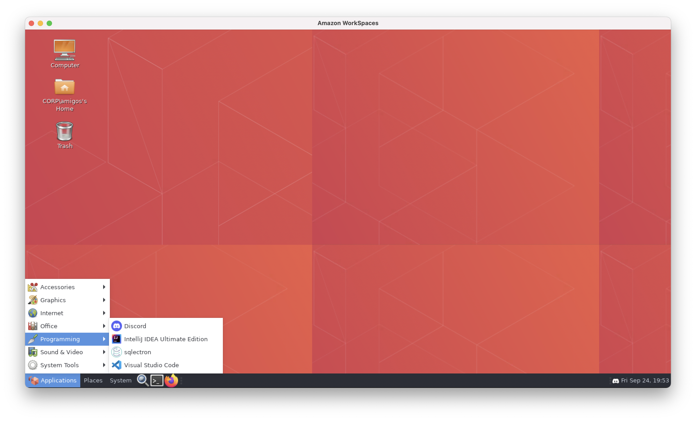

## Table of Contents
- [What is a Workspace](#what-is-a-workspace)
- [Your Workspace specs](#your-workspace-specs)
- [Pre Installed Software and Applications](#pre-installed-software-and-applications)
- [Workspace Setup](#workspace-setup)
  * [Follow the instructions on the email sent from **Amazon WorkSpaces**](#follow-the-instructions-on-the-email-sent-from---amazon-workspaces--)
  * [Update User](#update-user)
  * [Download Client](#download-client)
  * [Register](#register)
  * [Login to your workspace](#login-to-your-workspace)
- [Terminal and oh-my-zsh](#terminal-and-oh-my-zsh)
  * [What is the terminal](#what-is-the-terminal)
  * [oh-my-zsh](#oh-my-zsh)
  * [oh-my-zsh tetup](#oh-my-zsh-tetup)
- [Discord](#discord)
  * [Register and Login to Discord](#register-and-login-to-discord)
  * [Discord Presence](#discord-presence)
  * [VSCODE and Discord Presence](#vscode-and-discord-presence)
  * [IntelliJ and Discord Presence](#intellij-and-discord-presence)
- [Done ✅](#done--)

# What is a Workspace   
Amazon WorkSpaces is a fully managed, persistent desktop virtualization service that enables your users to access the data, applications, and resources they need, anywhere, anytime, from any supported device. You can use Amazon WorkSpaces to provision either Windows or Linux desktops in just a few minutes and quickly scale to provide thousands of desktops to workers across the globe. Amazon WorkSpaces is deployed within an Amazon Virtual Private Cloud (VPC), and no user data is stored on the local device. This helps improve the security of user data and reduces your overall risk surface area.

Many organizations are making a permanent shift to a more flexible and more remote workforce, including more 'work from home' options. Amazon WorkSpaces enables you to give these workers fully functional Windows and Linux desktops in minutes, while increasing security by keeping data off of the end user's device, and increasing reliability with the power of the AWS Cloud.

# Your Workspace specs
- 4CPU Cores
- 16GB Ram
- 100GB Disk space

# Pre Installed Software and Applications
- Discord
- Visual Studio Code
- IntelliJ IDEA
- Node
- Docker
- MongoDB
- Mongo Compass
- Postgresql
- Sqlelectron (Database GUI Client)
- Feel free to install other applications you might need

# Workspace Setup
## Follow the instructions on the email sent from **Amazon WorkSpaces**

```
Dear Amazon WorkSpaces User,

Your administrator has created an Amazon WorkSpace for you. Follow the steps below to quickly get started with your WorkSpace:

1. Complete your user profile and download a WorkSpaces client using the following link: link

2. Launch the client and enter the following registration code: foo

3. Login with your newly created password. Your username is bar

You may download clients for additional devices at https://clients.amazonworkspaces.com/

Your WorkSpace is also enabled for Amazon WorkDocs. You can use Amazon WorkDocs to store, sync, and share your files. WorkDocs can automatically back up documents on your WorkSpace and sync documents to and from other devices such as a PC or Mac, so that you can access your data regardless of which desktop you are using. To use WorkDocs with your WorkSpace, follow the "Integrate with WorkDocs" instructions in the Amazon WorkSpaces User Guide:
https://docs.aws.amazon.com/workspaces/latest/userguide/workspaces-user-getting-started.html#workdocs-integration

When you set up WorkDocs, you will need to register and log in with the same registration code, username, and password that you use with your WorkSpace.

If you have any issues connecting to your WorkSpace, please contact your administrator.

Sincerely,

Amazon WorkSpaces
```
## Update User


## Download Client


## Register


## Login to your workspace


# Terminal and oh-my-zsh
## What is the terminal
Terminal, also known as command line or console, allow us to accomplish and automate tasks on a computer without the use of a graphical user interface.

## oh-my-zsh
Oh My Zsh is a delightful, open source, community-driven framework for managing your Zsh configuration. It comes bundled with thousands of helpful functions, helpers, plugins, themes, and a few things that make you shout...

In a nutshel it provides extra features that the default terminal does not come with.

## oh-my-zsh tetup
- Open the terminal

- copy and paste the following command 
```
sh -c "$(curl -fsSL https://raw.github.com/ohmyzsh/ohmyzsh/master/tools/install.sh)"
```

- type `y` then press `enter` on your keyboard

- Enter your password


- Still in the terminal copy and paste the following command and press enter 
```
echo 'exec zsh' >> $HOME/.bashrc
```

- copy and paste the following command and press enter
```
cat $HOME/.bashrc
```

and you should see `exec zsh` at the end of the screen


# Discord
## Register and Login to Discord
- Click on **Applications/Programming/Discord**



## Discord Presence
Shows what you are editing in VSCode and IntelliJ and supports over 140 of the most popular languages.

**Here's an example:**   


## VSCODE and Discord Presence
- Click on **Applications/Programming/Visual Studio Code**


- **Install Discord Presence**


## IntelliJ and Discord Presence
- Click on **Applications/Programming/IntelliJ IDEA**


- Click on **Plugins**


- Install **Discord Integration**


# Done ✅ 
<p align="center">
  
</p>